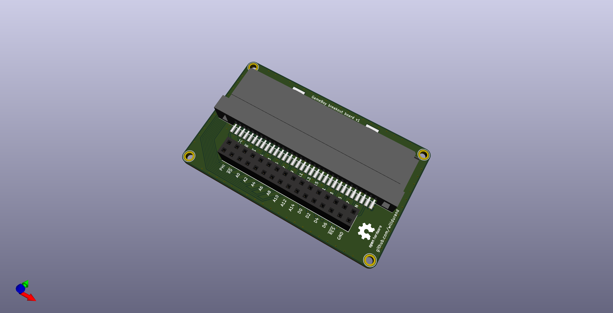

# gameboy-breakout-board

A simple breakout board for [this GameBoy connector](https://www.aliexpress.com/item/32832493101.html).

:warning: This board hasn't been tested yet.

## Bill of Materials

| Designator | Package                         | Quantity | Designation                                                           |
| ---------- | ------------------------------- | -------- | --------------------------------------------------------------------- |
| J1         | GB_GBC_1x32                     | 1        | [GameBoy card slot](https://www.aliexpress.com/item/32832493101.html) |
| J2         | PinSocket_2x16_P2.54mm_Vertical | 1        | Header                                                                |

## Installation

This project requires the following KiCad library:
[willdurand-kicad-libs](https://github.com/willdurand/willdurand-kicad-libs).

## License

All the files are released under the [Creative Commons Attribution-ShareAlike 4.0 International (CC BY-SA 4.0) license](https://creativecommons.org/licenses/by-sa/4.0/).
